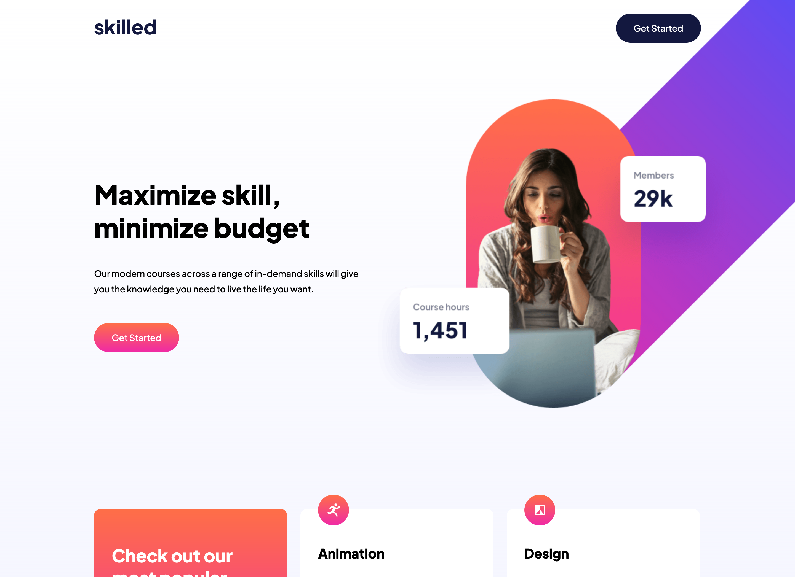

# Frontend Mentor - Skilled e-learning landing page solution

This is a solution to the [Skilled e-learning landing page challenge on Frontend Mentor](https://www.frontendmentor.io/challenges/skilled-elearning-landing-page-S1ObDrZ8q). Frontend Mentor challenges help you improve your coding skills by building realistic projects.

## Table of contents

- [Overview](#overview)
  - [The challenge](#the-challenge)
  - [Screenshot](#screenshot)
  - [Links](#links)
- [My process](#my-process)
  - [Built with](#built-with)
  - [What I learned](#what-i-learned)
  - [Continued development](#continued-development)
  - [Useful resources](#useful-resources)
- [Author](#author)

## Overview

### The challenge

Users should be able to:

- View the optimal layout depending on their device's screen size
- See hover states for interactive elements

### Screenshot



### Links

- Solution URL: [Add solution URL here](https://your-solution-url.com)
- Live Site URL: [Add live site URL here](https://your-live-site-url.com)

## My process
I chose to use sass, since I thought I knew it from work. What I didn't know was, that I work in an enviroment, where everything is setup by guys a lot smarter than me. So I used the better part of a day getting sass working.Then I sat up the html. Divided the page into the divs I need. Made the sass variables for colors, fonts etc. Since the mobile version seemed easy enough and my only real worry - what a fool I was - was how to get the hero image break the container. I couldn't figure out how to approach that, so I just jumped in the deep end. What a fool I was. First try was a grid. Crashed and burned. I never used grid, but I thought: "hey, what can go wrong! I'm no fool" What a fool I was. Next try. Flex on the hero container and grid on the cards. Crashed and burned all the way down, cause I couldn't get anything to align responsive. Then I watched some grid videos - Thank you Kevin Powell. Third time lucky. I got it working. I'm not really proud of it. I still rely on some pretty dodgy media querries and only have a like 75% grasp of why the choices I made are working. 

### Built with

- Semantic HTML5 markup
- CSS custom properties
- Flexbox
- CSS Grid
- Mobile-first workflow. Kinda

### What I learned

Well. I learned I'm a total fool. And then when nesting something in one media query you better damn well use the same nesting in the next or you will spend 3 hours looking for a stupid error.

```css
:root {
    // Gradient variables first time using sass variables and css variables. Worked pretty good. Be gentle
    --btn-grad-1: -webkit-gradient(linear, left top, left bottom, color-stop(0%, #{$gradient-1-clr-1}),
        color-stop(100%, #{$gradient-1-clr-2}));
    --btn-grad-2: -webkit-gradient(linear, left top, left bottom, color-stop(0%, #{$gradient-2-clr-1}),
        color-stop(100%, #{$gradient-2-clr-2}));
}
```


### Continued development

I'm diving deeper into grid and I hate to say this: My approach and my process.

### Useful resources

- [Resource 1](https://www.kevinpowell.co) - This helped me with my grid. 
- [Resource 2](https://www.youtube.com) - various sass sources.

## Author

- Website - [Add your name here](https://www.frontendmentor.io/profile/ByProxy66)
- Frontend Mentor - [@ByProxy66](https://www.frontendmentor.io/profile/ByProxy66)
- Mastodon - [@ByProxy@uiuxdev.social](https://uiuxdev.social/web/@ByProxy)


